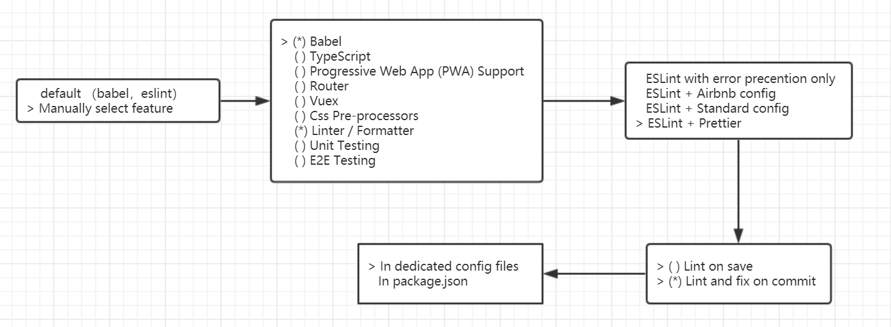

### 用[vue-cli](https://cli.vuejs.org/zh/)创建项目
```
yarn global add @vue/cli

vue create todomvc
```
暂时不勾选vue-router和vuex，可以使用default配置，本方案配置如下


### 使用todomvc模板和样式
+ 创建ToDo.vue
+ 使用[todomvc-app-template](https://github.com/tastejs/todomvc-app-template/blob/master/index.html)中的section
```html
<section class="todoapp">
  ...
</section>
```
+ 安装并引入[todomvc-app-css](https://github.com/tastejs/todomvc-app-css)